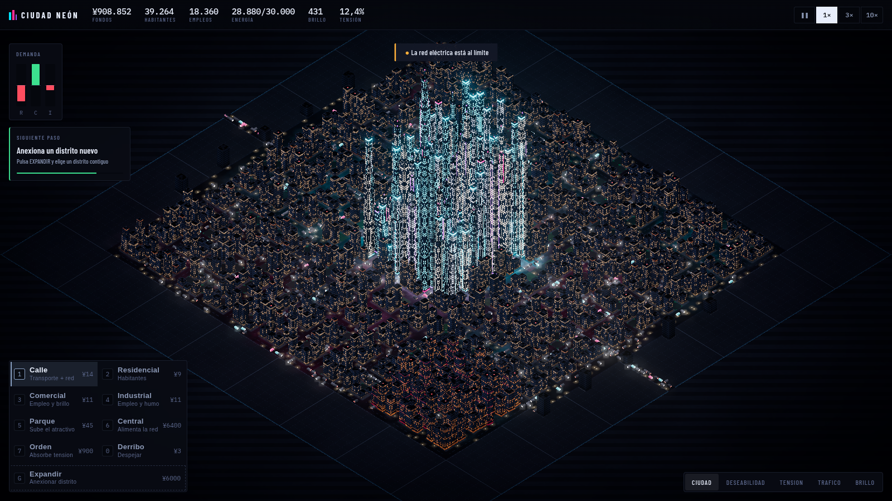

# CIUDAD NEÓN

Constructor y gestor de ciudades cyberpunk nocturno. Empiezas con una autopista
cruzando un solar vacío y terminas mirando una metrópolis de decenas de miles de
habitantes desde arriba.



## La idea

**Tú no colocas ni un solo edificio.** Colocas calles, zonas y servicios; lo que
se construye, hasta qué altura llega y cuándo se degrada lo deciden las
condiciones de cada casilla. De ahí viene la satisfacción de mirar la ciudad
terminada: el resultado es tuyo, pero no lo has dibujado a mano.

Regla dura del proyecto: **si un sistema no se puede ver en el mapa, no se
implementa.** La seguridad no es una barra, es un barrio que se degrada. El
déficit eléctrico no es un número en rojo, es un distrito que se apaga.

### Brillo contra Tensión

El neón no es decoración: es una estadística.

- El **brillo** lo generan la densidad comercial y los carteles. Multiplica los
  ingresos y **atrae población de fuera**, aunque tu mercado laboral ya esté
  equilibrado. Es, literalmente, lo bonita que es tu ciudad.
- Ese mismo brillo genera **tensión**, agravada por el *contraste*: un distrito
  deslumbrante pegado a un polígono industrial produce más tensión que
  cualquiera de los dos por separado. La tensión hunde la deseabilidad, frena el
  crecimiento y acaba expulsando población.
- Se gestiona con puestos de **Orden**, caros de mantener y que además apagan un
  poco el barrio que protegen. No hay solución gratis.

La consecuencia: **cuanto más espectacular haces la ciudad, más difícil es
gobernarla.** Tu impulso estético y la presión de gestión tiran en direcciones
opuestas, y esa fricción es el juego.

### Las cuatro presiones

| Presión | Se genera | Se ve en pantalla |
|---|---|---|
| **Energía** | Cada edificio consume según su nivel | El distrito se apaga de golpe |
| **Tráfico** | Viajes casa↔trabajo sobre el grafo viario | Los coches se frenan y se acumulan |
| **Deseabilidad** | Campo difuso: parques y brillo suman; industria, atascos y tensión restan | Los edificios suben y bajan de nivel |
| **Dinero** | Impuestos menos mantenimiento | — |

**La electricidad viaja por las calles.** No hay herramienta de tendido
eléctrico: la red viaria es a la vez transporte y energía, y eso convierte el
trazado en la decisión estructural de la partida.

## Jugar

```bash
npm install
npm run dev
```

| | |
|---|---|
| Clic izquierdo | Construir (arrastra para trazar) |
| Clic derecho | Mover la cámara |
| Rueda | Zoom |
| `Q` / `E` | Girar |
| `Z` / `X` | Inclinar la cámara (a 20° tienes vista de skyline) |
| `1`–`7`, `0` | Herramientas |
| `G` | Anexionar distrito |
| `Tab` | Cambiar de capa de datos |
| `Espacio` | Pausa |
| `F` | Encuadrar la ciudad |

Empieza ramificando calles desde la autopista, pon una central que **toque una
calle** y zonifica. La ciudad hace el resto.

## Arquitectura

```
src/
  core/     bucle de paso fijo, generador con semilla, emisor de eventos
  sim/      simulacion pura, sin Three.js, testeable sin navegador
  render/   escena, camara isometrica, shaders, post-proceso
  ui/       HUD en DOM plano, entrada, API de depuracion
  data/     balance.ts — todo el ajuste del juego en un solo fichero
```

**Separación innegociable:** `sim/` no importa nada de Three.js y `render/` nunca
escribe en el estado de la simulación. Por eso el juego se puede testear de
verdad y no solo mirar.

El estado del mundo son typed arrays paralelos (65.536 casillas, un array por
propiedad): cero objetos por casilla y cero presión sobre el recolector.

### Cómo se dibuja una ciudad entera

- **El suelo completo en una sola llamada de dibujo.** Asfalto, aceras, marcas
  viales, solares, alumbrado y la luz derramada sobre el pavimento se resuelven
  en el fragment shader a partir de dos texturas de estado. Pintar una avenida
  no cuesta nada en tiempo de render.
- **Fachadas procedurales.** Cada edificio es una caja instanciada; el shader
  dibuja la rejilla de ventanas en coordenadas de mundo, corrigiendo por la
  escala de la instancia para que cada planta mida lo mismo en un chalet que en
  una torre de cuarenta pisos. Miles de edificios con las ventanas encendidas
  una a una **en tres llamadas de dibujo**, y un apagón se aplica escribiendo un
  cero en un atributo.
- **Cuatro tipologías constructivas** sorteadas por la semilla de cada solar
  (retícula estrecha, retícula ancha, muro cortina, ventana corrida), más
  variación de material, altura, proporción, giro y posición dentro de la
  parcela. Sin eso, mil edificios alineados al milímetro sobre una cuadrícula
  perfecta se leen como un gráfico, no como una ciudad.
- **Volumen sin luces reales.** Miles de puntos de neón como luces serían
  inviables, así que el relieve sale de un ambiente de hemisferio más una luz
  clave muy tenue, petos de cubierta que recortan cada edificio del de al lado,
  y oclusión ambiental en el pavimento calculada a partir de la altura de los
  vecinos, que es lo que hace que los volúmenes se apoyen en el suelo.
- **Tráfico sin pathfinding.** La carga de cada calle sale de un algoritmo de
  cuenca fluvial: los viajes nacen en las viviendas y bajan por el gradiente
  hacia el empleo. Las arterias saturadas emergen solas del trazado. Los
  vehículos eligen giro ponderando por esa carga real, así que se concentran
  donde de verdad hay tráfico.
- **Niebla radial propia.** La de Three mide profundidad respecto a la cámara y
  con proyección ortográfica toda la escena está a la misma distancia.

## Verificación

```bash
npm test     # 22 pruebas de la simulacion
npm run smoke  # juega una partida completa en Chromium y saca capturas
```

`scripts/smoke.mjs` arranca el juego, traza una ciudad de 1.100 edificios,
comprueba invariantes (que crezca, que un apagón la deje a oscuras, que la
anexión de distritos funcione, que el HUD refleje el estado, que no haya errores
de consola), mide el tiempo de frame y guarda capturas en `artifacts/`.

Esa última parte no es un extra: es lo que permite iterar la estética de forma
autónoma. Ya ha cazado un shader que llevaba dos cambios sin compilar por usar
`patch`, palabra reservada en GLSL ES.

> El tiempo de frame que reporta la prueba se mide sobre SwiftShader (render por
> software) y no representa el rendimiento real con GPU.

## Estado y siguientes pasos

Lo que hay funciona de extremo a extremo: se puede jugar una partida completa
desde el solar vacío hasta una metrópolis de ~39.000 habitantes.

Pendiente:

- Reflejo especular real sobre el asfalto mojado (ahora es luz derramada y
  charcos procedurales, sin reflejo especular).
- Lluvia y variación de clima.
- Guardar y cargar la partida.
- Contratos de corporaciones: objetivos con condiciones que den narrativa.
- Avenidas y transporte público, para que el tráfico tenga más de una respuesta.
- Reconstrucción incremental de instancias: ahora se rehacen enteras cuando el
  mapa cambia, lo cual está medido y es suficiente a esta escala, pero no
  escalará al mapa de 256×256 completo.
